## Misión
  
Impulsar el desarrollo colectivo utilizando la **tecnología** como herramienta para generar un **cambio positivo** en la comunidad.

## Visón
  
Ser reconocidos como el grupo estudiantil modelo para la incursión de las **nuevas tecnologías** y promoverlas dentro de nuestra **comunidad**.

# Metas
## Corto plazo

- Toma de protesta del CIT.
- Habilitar un área de desarrollo.
- Demostración de prototipos de IoT en el concurso de programación local 2018.
- Constituir equipos de trabajo multidisciplinarios.
- Difundir a preparatorias los módulos de especialidad de la Industria 4.0 para incrementar la matricula en las carreras.
- Participación en el Hackathon “Talent Land” en la ciudad de Guadalajara, Jalisco.

## Largo plazo

- Ser competitivos, siendo protagonistas en los torneos que se participen.
- Vinculación escuela-empresa donde se recluten estudiantes para implementar proyectos en la Industria 4.0.
- Ser protagonistas de eventos académicos como Hackathones y Startups con la participación de universidades y/o tecnológicos locales.
- Participación destacada en eventos locales, regionales y nacionales como lo es el ENEIT (Evento Nacional Estudiantil de Innovación Tecnológica).

# Colaboraciones

## 

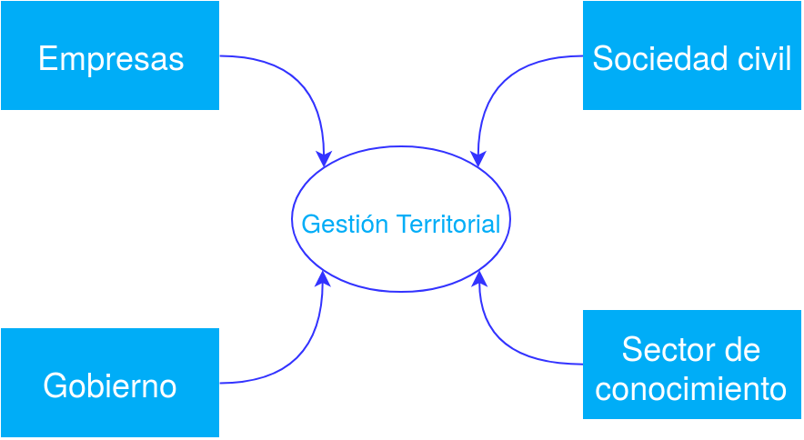{ width=100% }

##
    

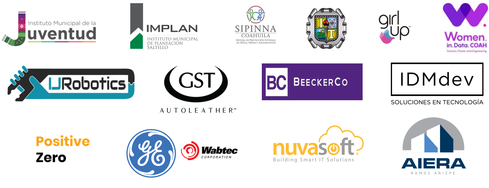{ width=100% }

## HUB Innovación Coahuila 4.0
Gracias a las habilidades de  los miembros del CIT y a la experiencia con ciertas **tecnologías innovadoras**, fuimos los únicos alumnos universitarios de todo el estado invitados al HUB Coahuila 4.0, donde nos especializamos en las tecnologías de la **I4.0** a traves capacitaciones e implementado proyectos con el conocimiento adquirido.

  
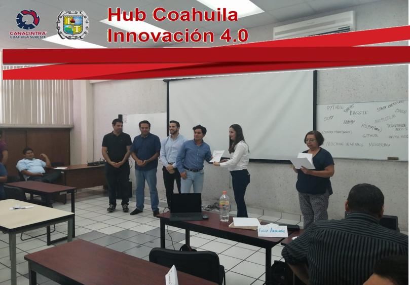{ width=45% }

## Tecnologías

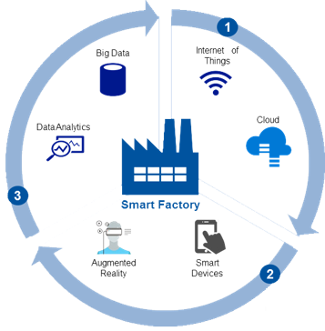{ width=60% }

## Software Dev.

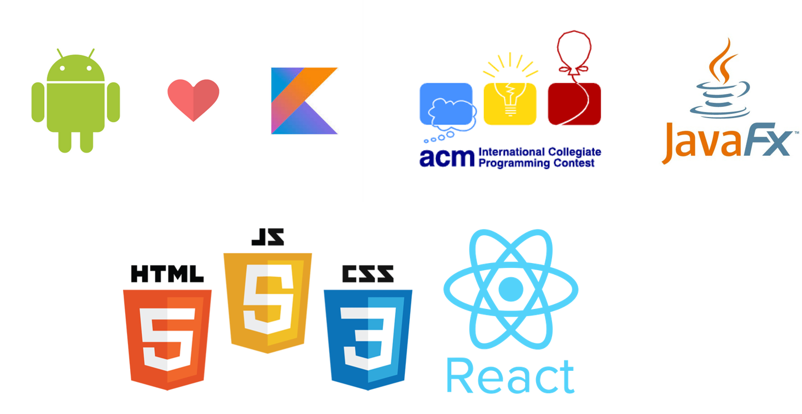{ width=100% }

## AR / VR

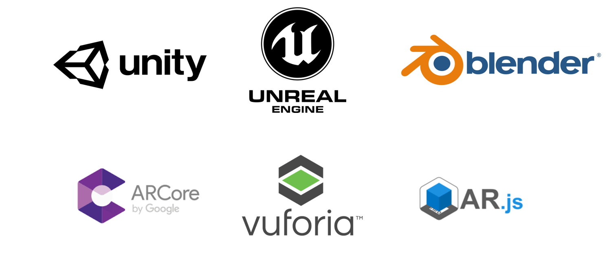{ width=100% }

## Sistemas Embebidos

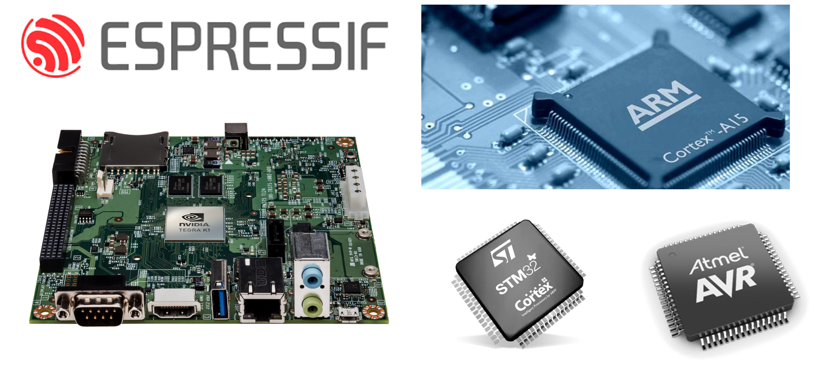{ width=100% }

## IIOT

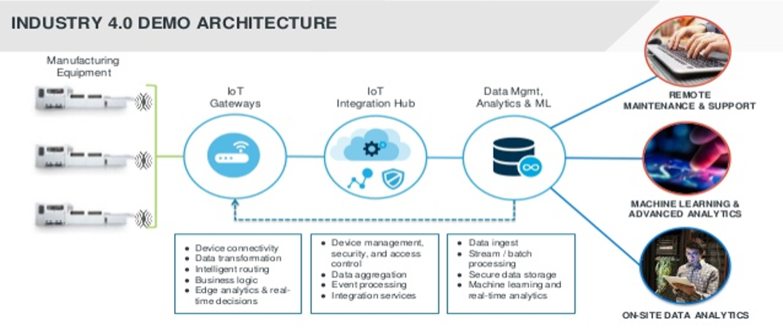{ width=100% }

## 

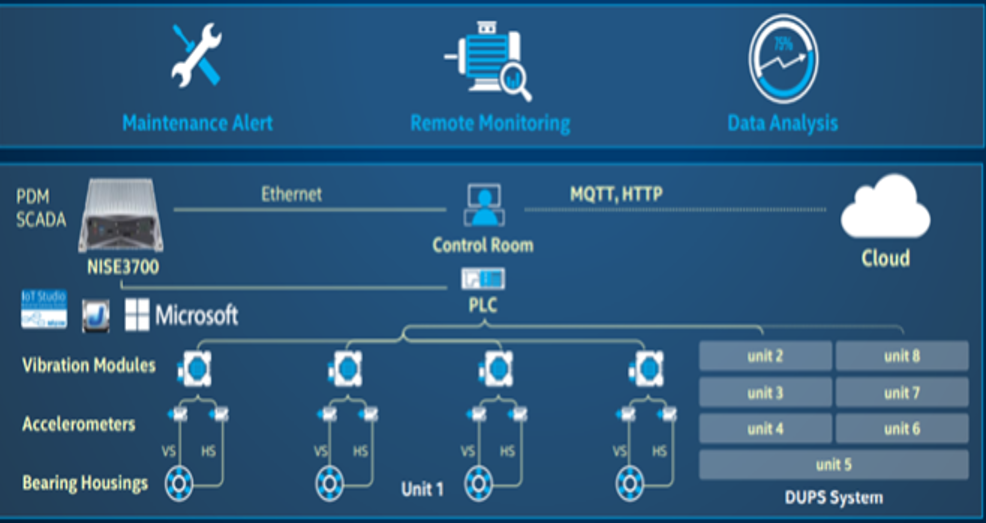{ width=100% }

## ¿Cómo Sumarte?
  
Colaboremos juntos utilizando una Dirección de Innovación (DI)

- Creación de vínculos de colaboración con empresas y organismos públicos y privados
- Transferir las tecnologías desarrolladas por el CIT  o con alianzas estratégicas a través de proyectos tecnológicos

  
La vía para generar vínculos de colaboración con el CIT es a través de la elaboración y firma de contratos o convenios

# Vínculos de colaboración

## Tech Intership
  
Otorgar jóvenes estudiantes para que elaboren sus prácticas profesionales de acuerdo a las habilidades de los mismos
 
Recomendado para empresas que ya tienen un departamento que impulse las tendencias tecnológicas

## Maker
  
Elaboración de un Makerspace dentro de la empresa para solucionar problemas con un enfoque de desarrollo tecnológico en nuevas tecnologías.
 
Ideal para arrancar grupos de desarrollo tecnológico dentro de la empresa con enfoque 4.0.

## Revolution 4.0
  
Proyecto a gran escala en colaboración ya sea con nuestros asesores investigadores SNI, o trabajando en conjunto con nuestra alianza estratégica con la empresa IJ Robotics formando así una incubadora de talento.
 
Orientado a empresas que desean dar un cambio significativo a sus procesos con el fin de ser una *Smart Factory*

# Alianzas Estratégicas

## IJ Robotics
  

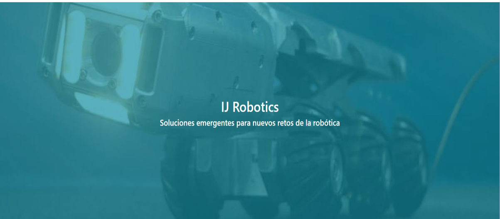{ width=100% }

##
  

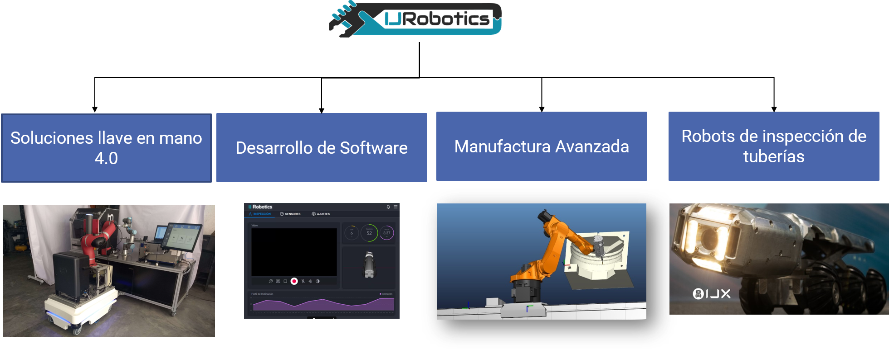{ width=100% }

## Instituciones unidas al proyecto I4.0 con IJ Robotics

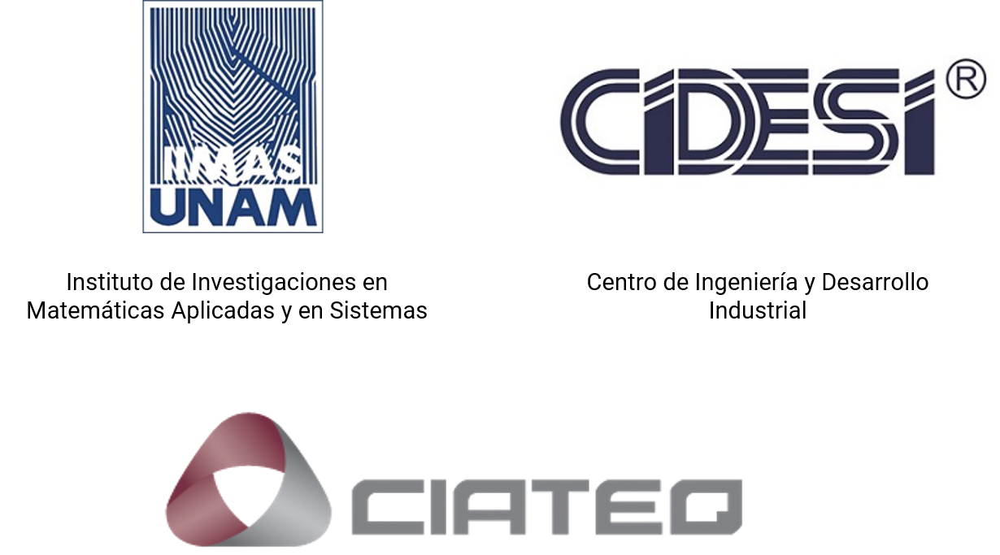{ width=100% }

##

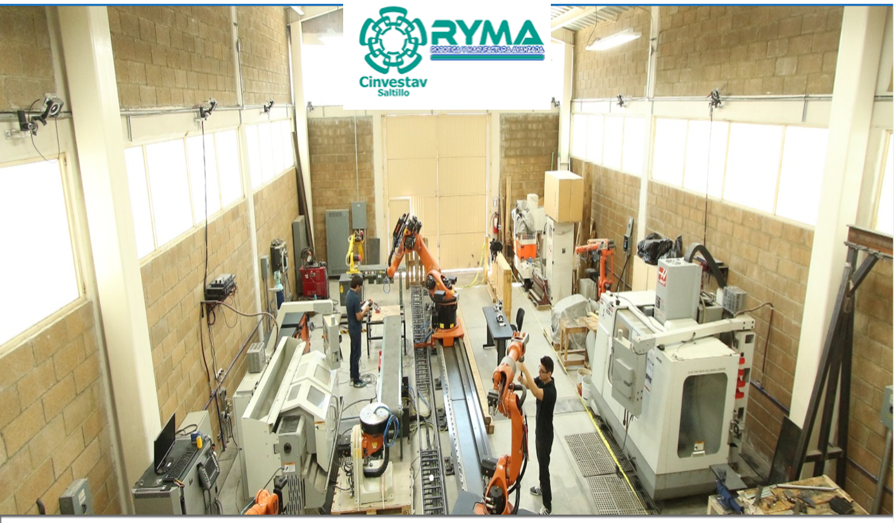{ width=100% }

## I4.0

{ width=100% }

## IJX

{ width=100% }

